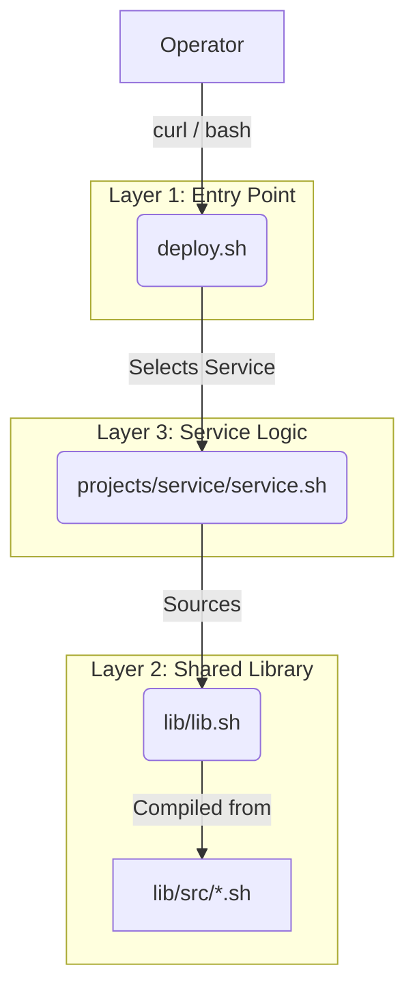

# System Architecture

This document describes the technical design, security principles, and architectural patterns of the `docker-develop` framework.

---

## 1. The 3-Layer Design

The framework is organized into three distinct layers to separate concerns and maximize reusability:

### Layer 1: Universal Entry Point (`deploy.sh`)
- **Role**: Pure dispatcher and service discovery.
- **Responsibility**: Maintains a registry of available services, checks their local installation status, and downloads/launches the specific service script.
- **Constraint**: It contains NO service-specific logic (ports, paths, etc.).

### Layer 2: Functional Foundation (`lib/`)
- **Role**: Standardizes security, permissions, and diagnostics.
- **Responsibility**: Provides the "engine" for installation, health checks, and uninstallation.
- **Pattern**: **Compiled Bash Architecture**. Sources are split into `lib/src/` for development but compiled into a single `lib.sh` for production delivery via `curl`.

### Layer 3: Service Projects (`projects/`)
- **Role**: Implementation of specific software (Caddy, Arcane, etc.).
- **Responsibility**: Defines the Docker Compose stack, internal environment templates, and specific health endpoints.
- **Pattern**: Thin wrappers around the shared library.

---

## 2. Compiled Bash Architecture

To solve the conflict between **Code Maintainability** (small, focused files) and **Deployment Simplicity** (single-file `curl` pipe), we use a build-step:

1.  **Source Modules (`lib/src/*.sh`)**:
    - `01_core.sh`: Logging and fundamental security guards.
    - `02_install.sh`: Environment bootstrapping and file management.
    - `03_health.sh`: Deployment validation and HTTP probes.
    - `04_uninstall.sh`: The generic uninstallation engine.
2.  **Compiler (`lib/build.sh`)**: Concatenates sources with module markers and a "DO NOT EDIT" warning.
3.  **Automation (`githooks/pre-commit`)**: A Git hook that automatically runs the compiler before every commit, ensuring `lib.sh` is always up-to-date with its sources.

---

## 3. Generic Uninstallation Engine

Uninstallation is centralized in `lib/src/04_uninstall.sh` to ensure consistency and prevent accidental data loss.

**Workflow**:
1.  **Stop & Disable**: Stops the systemd service and removes unit files.
2.  **Cleanup Containers**: Forcefully removes defined containers.
3.  **Image Cleanup**: Removes service-specific images.
4.  **Data Decision**:
    - **Interactive Mode**: Lists exactly which volumes and directories will be deleted and asks for confirmation.
    - **Safe-guard**: If data is preserved, the script only cleans up the "management" files (`.env`, `docker-compose.yml`) but keeps the directory and persistent data intact.

---

## 4. Dynamic URL & Branch Mapping

The framework supports dynamic testing of branches without hardcoding URLs.

- **`GIT_BRANCH`**: Defaults to `main`. Can be overridden to test features (e.g., `GIT_BRANCH=dev bash deploy.sh`).
- **Cascading URLs**: `deploy.sh` sets the base URL, which is then passed to service scripts, which in turn use it to fetch the library and their own assets.
- **Local Development**: Setting `LIB_LOCAL=/path/to/lib.sh` allows testing new library features without pushing to GitHub.

---

## 5. Security Principles

1.  **Non-root Execution**: All operations must run as a standard user to preserve Podman rootless isolation.
2.  **Secret Isolation**:
    - No secrets are committed to the repository.
    - Templates in `config.env` are audited for accidental leaks.
    - `JWT_SECRET` and keys are auto-generated on the first install.
3.  **File Hardening**:
    - Runtime `.env` files are created with `umask 177` (permissions `600`).
4.  **Privileged Port Handling**:
    - Instead of running as root, the script uses `sysctl` (via a one-time `sudo` call) to allow unprivileged users to bind ports 80/443.
