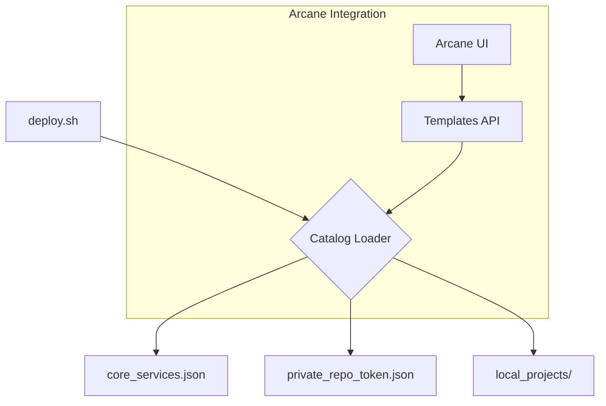

# Design Analysis: Scalable Service Catalog & Mixed Architecture

This document analyzes the current bottlenecks of the `docker-develop` framework and proposes a professional-grade architecture to transition from a "test/pre-production tool" to a "commercial-grade orchestrator" with native Arcane and multi-repository support.

---

## 1. Current Bottlenecks & Strategic Issues

### 🐌 The `deploy.sh` Scaling Problem

The current menu loop is **O(N)**. For every service in the `REGISTRY`, it performs a `podman container exists` check.

- **Latency**: With 20+ services, the lag becomes noticeable.
- **Redundancy**: It re-checks status on every menu redraw, even if nothing changed.

### 🧩 Monolithic Registry

The service list is hardcoded in `deploy.sh`.

- **Inflexibility**: Adding private or third-party services requires modifying the core script.
- **IP Protection**: There is no clean way to separate "Public Core Services" from "Private Proprietary Services".

### 🌉 The UI-CLI Gap

Arcane shows what is running, but it doesn't "know" how to install new things using our `lib.sh` logic without manual script execution.

---

## 2. Proposed Architecture: The "Service Provider" Model

We should move from a hardcoded array to a **Dynamic Catalog System**.

### 2.1. Discovery Engine Optimization (Instant Load)
Instead of checking services one by one, we perform a **Single-Pass State Mapping**:

```bash
# Optimized status gathering
# This gets all running containers and their compose project in ONE call.
RUNNING_PROJECTS=$(podman ps --format "{{.Labels}}" | grep -oP 'com.docker.compose.project=\K[^,]+' | sort -u)

# Check installation status via filesystem only (zero-latency)
# Then cross-reference with RUNNING_PROJECTS for "Running" status.
```

### 2.2. Distributed Registries (Multi-Repo Support)

Introduce a `.registry.d/` directory or a `catalog.json` that supports remote sources.



### 2.3. The "Provider" Refactor

Move from `projects/<slug>/<slug>.sh` to a more structured approach:

1. **Metadata Layer**: A `manifest.yaml` (or expanded `.registry`) defining dependencies, ports, and icons.
2. **Logic Layer**: The `<slug>.sh` remains but becomes more "headless" (optimized for non-interactive use by Arcane).
3. **Config Layer**: Reuse shared `config.env` logic.

---

## 3. Mixed Solution: Arcane + CLI + Private Repo

To achieve the "commercial" feel while protecting Intellectual Property:

### 3.1. Infrastructure as a Service (IaaS) Catalog

- **The Repo**: Host the configurations in a private Git repo.
- **The Token**: Arcane handles the `GIT_TOKEN`.
- **The Execution**:

  - `deploy.sh` can be configured with a `REMOTE_SOURCES` list.
  - It downloads manifests and presents them in the menu.

### 3.2. Native Arcane Bridge (The "Agent" Approach)

As suggested in `ARCANE_EVOLUTION_ANALYSIS.md` (Option B), we implement a **Local Execution Socket**.

1. **Arcane** sends an "Install" command via Webhook/Socket.
2. **A Local Runner** (part of `lib.sh`) receives the command.
3. **The Runner** executes `bash service.sh install --yes`.
4. **Benefit**: You get the "One-Click" commercial experience in the UI, but the "Powerful Scripting" robustness underneath.

---

## 4. Immediate Roadmap (Next Steps)

| Step | Task | Goal |
| :--- | :--- | :--- |
| **1** | **Global Status Cache** | Refactor `deploy.sh` to use one `podman ps` call at start. |
| **2** | **External Registry Loader** | Allow `deploy.sh` to scan `projects/*/.registry`. (DONE) |
| **3** | **JSON Manifests** | Transition `.registry` files to a more descriptive JSON/YAML format. |
| **4** | **Arcane Template Generator** | Script to generate Arcane's `templates.json` from our projects. |
