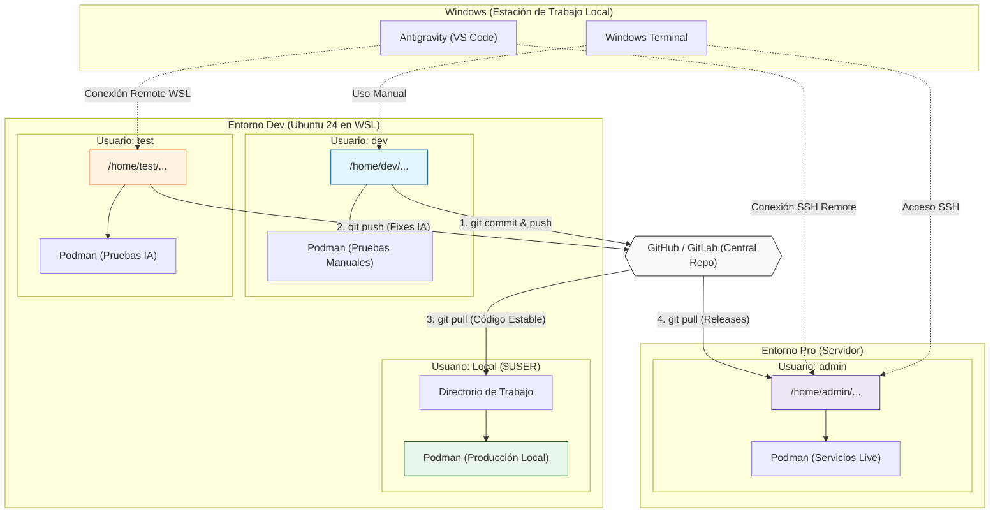

# Entorno de Trabajo Profesional: Dev, Test & Pro

Este documento define la arquitectura y el flujo de trabajo para el desarrollo, las pruebas impulsadas por IA y el despliegue en producción.

## Arquitectura de Entornos y Usuarios

La estrategia se basa en aislar las responsabilidades mediante el uso de diferentes usuarios de Linux (*Rootless*), tanto a nivel local (WSL) como remoto (Servidor).

### 1. Entorno Dev (Ubuntu 24 en WSL - Local)

Este entorno físico contiene tres usuarios con roles diferenciados:

*   **Usuario Local (`$USER`)**
    *   **Rol**: Equivalente al entorno de *Producción Local*.
    *   **Propósito**: Aquí se ejecutan las versiones estables y validadas de tu framework (`docker-develop`). Es el entorno "seguro" del día a día.
*   **Usuario `dev`**
    *   **Rol**: Usuario *Rootless* con permisos `sudo`.
    *   **Propósito**: Es **tu** espacio de trabajo. Lo usas desde Windows Terminal para ejecutar comandos manuales, hacer pruebas de concepto, probar contenedores y desarrollar sin riesgo de romper el entorno local.
*   **Usuario `test`**
    *   **Rol**: Usuario *Rootless*.
    *   **Propósito**: Espacio de trabajo exclusivo para **Antigravity (IA)**. Antigravity se conecta aquí vía "Remote WSL" para investigar bugs, analizar código y ejecutar comandos de debugging automáticos (previo permiso por chat) sin manchar el historial o los archivos de tu usuario `dev`.

### 2. Entorno Pro (Servidor Externo)

*   **Usuario `admin`**
    *   **Rol**: Usuario *Rootless* con permisos `sudo`.
    *   **Propósito**: Único encargado de correr los servicios reales accesibles al público.
    *   **Acceso**: Conectado a Windows Terminal y a Antigravity exclusivamente mediante **SSH con Private Key** (para máxima seguridad y control remoto de despliegues).

---

## Diagrama de Flujo (Mermaid)

El siguiente gráfico ilustra cómo interactúan los usuarios, las herramientas (Windows Terminal / Antigravity) y el código a través de Git.



---

## Guía Paso a Paso: Configuración del Entorno Local (WSL)

A continuación se detalla el proceso técnico para levantar la infraestructura de usuarios en tu máquina local con Ubuntu 24.04 WSL.

### 1. Creación de Usuarios Locales

Desde la terminal principal de tu Ubuntu (con tu usuario habitual):

```bash
# 1. Crear el usuario para desarrollo manual
sudo adduser dev

# 2. Asignar permisos sudo al usuario dev (necesario para gestionar paquetes y configuraciones)
sudo usermod -aG sudo dev

# 3. Crear el usuario para automatización/IA
sudo adduser test
```

### 2. Habilitar la Ejecución de Contenedores Rootless

Para que `dev` y `test` puedan ejecutar contenedores con Podman sin requerir privilegios de root, necesitamos asignar sub-rangos de IDs y persistencia.

```bash
# 1. Asignar rangos de Sub-UIDs y Sub-GIDs a cada usuario
sudo usermod --add-subuids 100000-165535 --add-subgids 100000-165535 dev
sudo usermod --add-subuids 200000-265535 --add-subgids 200000-265535 test

# 2. Habilitar Linger (Persistencia de red y procesos en segundo plano para servicios podman)
sudo loginctl enable-linger dev
sudo loginctl enable-linger test
```

### 3. Instalación Base de Herramientas Peticiones (En cada usuario)

Inicia sesión en cada cuenta para dejar preparado el entorno base (repite para `test`):

```bash
sudo su - dev
# Actualizar sistema e instalar utilidades básicas y Git
sudo apt update && sudo apt install -y curl wget git nano

# Instalación de Podman y Podman-Compose
sudo apt install -y podman podman-compose

# Preparar la estructura de carpetas
mkdir -p ~/projects
cd ~/projects

# Clonar el proyecto principal
git clone https://github.com/TU_USUARIO/docker-develop.git
```

### 4. Integración con Windows Terminal

Para acceder cómodamente a tu usuario `dev` y aislar tus sesiones, edita el archivo `settings.json` de Windows Terminal añadiendo estos perfiles:

```json
{
    "guid": "{57604d44-245c-4573-9f7a-87441b2a9f57}",
    "name": "Ub 24 - Dev",
    "commandline": "wsl.exe -d Ubuntu-24.04 -u dev --cd ~",
    "startingDirectory": "//wsl$/Ubuntu-24.04/home/dev",
    "icon": "https://assets.ubuntu.com/v1/49a1a858-favicon-32x32.png"
},
{
    "guid": "{a8c91c3e-767c-44ae-9eca-7c7cda4f0449}",
    "name": "Ub 24 - Test",
    "commandline": "wsl.exe -d Ubuntu-24.04 -u test --cd ~",
    "startingDirectory": "//wsl$/Ubuntu-24.04/home/test",
    "icon": "https://assets.ubuntu.com/v1/49a1a858-favicon-32x32.png"
}
```

### 5. Integración con Antigravity (VS Code)

El usuario `test` es el "campo de juego" del agente de IA. Para que Antigravity actúe de forma autónoma allí:

1.  Abre VS Code y presiona el botón verde de **Remote WSL** en la esquina inferior izquierda.
2.  Selecciona **Connect to WSL using Distro...** y elige **Ubuntu-24.04**.
3.  **Cambio de Usuario por Defecto**: Como VS Code entra con tu `$USER` principal, abre la configuración remota de WSL en VS Code (Command Palette `Ctrl+Shift+P` > `Preferences: Open Remote Settings (WSL: Ubuntu-24.04)`).
4.  Busca `remote.wsl.serverUser` y configúralo temporalmente como `"test"` (o ajusta el daemon de WSL mediante `/etc/wsl.conf` si dedicas la instancia a este único propósito).
5.  Abre la carpeta del repositorio clonado en `/home/test/projects/docker-develop`.
6.  A partir de este momento, cuando le pidas a Antigravity ejecutar comandos o auditar código, actuará nativamente sobre el usuario `test` sin tocar tus archivos de `dev`.

## Flujo Operativo del Día a Día

1.  **Encuentras un problema**: Detectas un fallo en el Usuario Local o tienes que desarrollar una "feature".
2.  **Desarrollo Manual (`dev`)**: Entras a tu terminal como `dev`, programas y haces pruebas.
3.  **Delegación a IA (`test`)**: Si es un *bug* difícil, me pides por chat que revise el repositorio en el usuario `test`. Yo ejecuto comandos allí, levanto contenedores, examino logs y aplico el parche. Subo los fixes a GitHub.
4.  **Despliegue Local**: Una vez la rama en GitHub está estable, haces `git pull` en tu Usuario Local (`$USER`) para tu uso diario.
5.  **Despliegue a Producción**: A través de SSH, entras al usuario `admin` del servidor, haces `git pull` y lanzas `podman-compose up -d`. Todo seguro, trazable y sin interrupciones.
